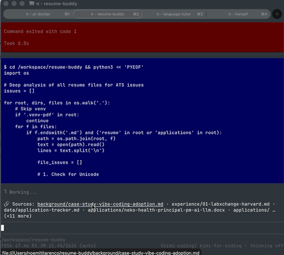

# pi-container-links

Clickable file links for [Pi](https://github.com/earendil-works/pi) when running inside containers.

## The Problem

When Pi runs inside a Docker container (or dev container, remote SSH, etc.), it sees files at paths like `/workspace/src/foo.ts`. But your host filesystem has them at `/Users/you/project/src/foo.ts`. Terminal OSC 8 hyperlinks with `file:///workspace/...` don't work on the host because that path doesn't exist there.

**Result:** You see file paths in Pi's responses, but you can't Cmd+Click them open.

## The Solution

This extension auto-detects file paths in Pi's assistant responses, maps container paths to host paths, and displays them as clickable OSC 8 hyperlinks in a **Sources** widget above the editor.



## Features

- **Auto-extraction** — Finds file paths in assistant message text (absolute, relative, or bare)
- **Line:column support** — Detects `path:42` and `path:42:10` patterns
- **Container→host mapping** — Configurable path prefix translation
- **Persistent widget** — "Sources" panel above the editor with last N links
- **Session persistence** — Links survive `/reload` via session entries
- **LLM tool** — `register_source_link` lets the agent explicitly add links
- **BEL terminator** — Maximum OSC 8 compatibility across terminals

## Installation

```bash
pi install npm:pi-container-links
```

Or from GitHub:

```bash
pi install git:github.com/noemit/pi-container-links
```

## Configuration

### `PI_PATH_MAP` — Container→Host Path Mapping

**Required** if auto-detection doesn't work for your setup.

Format: `containerPrefix:hostPrefix`

```bash
# Docker Desktop on macOS (most common)
export PI_PATH_MAP=/workspace:/Users/you

# Dev container with different mount
export PI_PATH_MAP=/workspaces/my-project:/Users/you/code/my-project

# Multiple mappings (not yet supported, use the longest prefix)
```

**When you need to set it:**
- Your container working directory is NOT `/workspace`
- Your host home is NOT under `/Users/` (Linux, custom setup)
- Auto-detection fails (check with `echo $PI_PATH_MAP` inside Pi)

**Auto-detection** works when:
- `PI_PATH_MAP` is unset
- `process.cwd()` starts with `/workspace`
- `$HOME` starts with `/Users/` (macOS)

→ In this case it auto-maps `/workspace` → `$HOME`

### `PI_SOURCES_MAX_LINKS`

Max links shown in the Sources widget (default: 5).

```bash
export PI_SOURCES_MAX_LINKS=10
```

### `PI_SOURCES_WIDGET`

Set to `0` to disable the widget entirely (links still tracked, `/sources` still works):

```bash
export PI_SOURCES_WIDGET=0
```

## Usage

Just talk to Pi. When it mentions files, they appear in the Sources widget:

```
🔗 Sources (Cmd+Click):
src/components/Button.tsx
src/components/Input.tsx
```

**Widget commands:**
- `/hide-sources` — Hide the widget (links still tracked)
- `/show-sources` — Show the widget again
- `/sources-limit 10` — Change how many links appear in the widget (1–50)

**Link commands:**
- `/sources` — Show recent links from the current conversation context
- `/sources-all` — Show every link collected this session
- `/clear-sources` — Clear link history

**Tool for the LLM:**
- `register_source_link` — Explicitly register a link with optional label

## Supported Terminals

Any terminal supporting OSC 8 hyperlinks:

- ✅ Ghostty
- ✅ iTerm2 3.1+
- ✅ Kitty
- ✅ WezTerm
- ✅ Windows Terminal
- ✅ GNOME Terminal (VTE 0.50+)
- ✅ foot
- ✅ Konsole
- ✅ Alacritty (recent)

## How It Works

1. Listens to `message_end` events from assistant responses
2. Extracts path-like strings using regex
3. Strips `line:column` suffixes for display, adds them as URL fragments
4. Maps container paths to host paths via `PI_PATH_MAP`
5. Generates OSC 8 hyperlinks with BEL terminator (`\x07`)
6. Displays in widget via `ctx.ui.setWidget()`
7. Persists to session via `pi.appendEntry()`

## License

MIT
